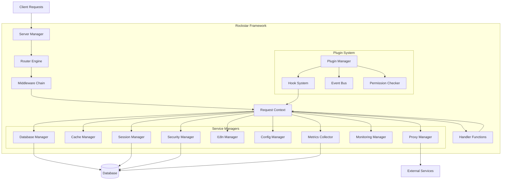

# Architecture Overview

The Rockstar Web Framework is designed as a comprehensive, batteries-included framework that provides enterprise-grade features while maintaining high performance and clean architecture. This document explains the overall framework design, key architectural decisions, and how components work together.

## Design Philosophy

The framework is built on several core principles:

1. **Batteries Included**: Provide complete functionality out of the box without requiring developers to wire together multiple libraries
2. **Context-Driven**: All framework services are accessed through a unified Context interface, eliminating global state
3. **Interface-Based**: Clean separation between contracts (interfaces) and implementations enables testing and customization
4. **Manager Pattern**: Framework services are organized as managers with well-defined responsibilities
5. **Plugin Architecture**: Extensibility through a robust plugin system with lifecycle management and permissions
6. **Multi-Protocol Support**: Native support for HTTP/1, HTTP/2, QUIC, and WebSocket protocols
7. **Performance First**: Arena-based memory management, connection pooling, and efficient routing

## High-Level Architecture

## Core Components

### Framework Struct

The `Framework` struct is the central orchestrator that wires all components together. It:

- Initializes all managers with proper configuration
- Manages the application lifecycle (startup, running, shutdown)
- Provides access to all framework services
- Coordinates plugin system initialization
- Handles graceful shutdown with cleanup hooks

**Key Responsibilities:**
- Component initialization and dependency injection
- Lifecycle management (startup hooks, shutdown hooks)
- Global middleware registration
- Server configuration and startup

### Server Manager

The Server Manager handles HTTP server lifecycle and protocol support:

- Creates and manages HTTP/1, HTTP/2, and QUIC servers
- Handles TLS certificate management
- Manages graceful shutdown with connection draining
- Supports multiple concurrent servers
- Integrates with the router for request handling

**Protocol Support:**
- HTTP/1.1: Standard HTTP protocol
- HTTP/2: Multiplexed connections with server push
- QUIC: UDP-based protocol with built-in encryption
- WebSocket: Full-duplex communication channels

### Router Engine

The Router Engine provides flexible request routing:

- HTTP method-based routing (GET, POST, PUT, DELETE, etc.)
- Path parameter extraction (`/users/:id`)
- Route groups with shared middleware
- Host-based routing for multi-tenancy
- Static file serving with virtual file systems
- WebSocket endpoint registration
- API protocol routing (GraphQL, gRPC, SOAP)

**Routing Features:**
- Efficient route matching with parameter extraction
- Middleware composition at route and group levels
- Host-specific routing for tenant isolation
- Support for multiple API styles

### Request Context

The Context interface is the heart of the framework's design. It provides:

- Unified access to all framework services
- Request and response data
- Session and authentication state
- Database and cache access
- Configuration and internationalization
- File operations and logging
- Metrics collection

**Design Benefits:**
- No global state - everything is request-scoped
- Easy testing through interface mocking
- Clear service boundaries
- Dependency injection without frameworks

## Service Managers

### Database Manager

Provides database abstraction supporting multiple engines:

- **Supported Databases**: MySQL, PostgreSQL, MSSQL, SQLite
- **Features**: Connection pooling, prepared statements, transactions
- **Framework Integration**: Session storage, token management, tenant data
- **SQL Organization**: Externalized queries in `sql/{driver}/` directories

The Database Manager can be optionally disabled, with the framework falling back to in-memory storage for sessions and other data.

### Cache Manager

Implements request-level and application-level caching:

- **Request Caching**: Automatic caching of request data
- **Application Caching**: Key-value storage with TTL support
- **Strategies**: LRU eviction, time-based expiration
- **Integration**: Used by proxy, session, and custom handlers

### Session Manager

Manages user sessions with multiple storage backends:

- **Storage Options**: Database, cache, or memory
- **Features**: Encrypted session data, automatic expiration
- **Security**: CSRF protection, secure cookie handling
- **Multi-Tenancy**: Tenant-scoped session isolation

### Security Manager

Provides comprehensive security features:

- **Authentication**: OAuth2, JWT, session-based
- **Authorization**: Role-Based Access Control (RBAC)
- **Protection**: CSRF tokens, XSS prevention, rate limiting
- **Token Management**: Access token generation and validation
- **Encryption**: Secure session and data encryption

### Configuration Manager

Handles application configuration:

- **Formats**: YAML, JSON, TOML, INI
- **Sources**: Files, environment variables
- **Features**: Hot reload, validation, defaults
- **Access**: Type-safe configuration retrieval

### I18n Manager

Supports internationalization:

- **Format**: YAML locale files
- **Features**: Pluralization, parameter substitution
- **Detection**: Language detection from headers
- **Fallback**: Graceful fallback to default language

### Metrics Collector

Collects application metrics:

- **Metrics**: Request counts, durations, errors
- **Storage**: In-memory or database-backed
- **Export**: Prometheus-compatible format
- **Integration**: Automatic request tracking

### Monitoring Manager

Provides observability:

- **Health Checks**: Endpoint health monitoring
- **Profiling**: CPU and memory profiling
- **Logging**: Structured logging with levels
- **Workload Tracking**: Performance metrics collection

### Proxy Manager

Enables reverse proxy functionality:

- **Features**: Load balancing, caching, header manipulation
- **Protocols**: HTTP/HTTPS proxying
- **Integration**: Works with cache manager for response caching

## Plugin System

The plugin system provides extensibility without compromising security or stability:

### Plugin Manager

Orchestrates plugin lifecycle:

- **Discovery**: Automatic plugin discovery at startup
- **Initialization**: Dependency resolution and initialization
- **Lifecycle**: Start, stop, cleanup hooks
- **Health**: Plugin health monitoring and error isolation

### Hook System

Enables plugins to intercept framework events:

- **Hook Types**: Startup, shutdown, pre/post request, error
- **Priority**: Ordered execution based on priority
- **Context**: Access to request context and framework services
- **Control Flow**: Ability to skip remaining hooks

### Event Bus

Facilitates inter-plugin communication:

- **Publish/Subscribe**: Event-based messaging
- **Isolation**: Plugin-scoped event handlers
- **Async**: Non-blocking event delivery
- **Filtering**: Event filtering by type

### Permission System

Controls plugin access to framework services:

- **Permissions**: Database, cache, config, router, filesystem, network
- **Enforcement**: Runtime permission checking
- **Granular**: Fine-grained permission control
- **Security**: Prevents unauthorized access

## Data Flow

### Request Processing Flow

1. **Server Receives Request**: HTTP server accepts incoming connection
2. **Router Matching**: Router finds matching route and extracts parameters
3. **Context Creation**: Request context is created with all managers
4. **Middleware Execution**: Global and route-specific middleware execute
5. **Plugin Hooks**: Pre-request hooks execute (if plugins enabled)
6. **Handler Execution**: Route handler processes the request
7. **Plugin Hooks**: Post-request hooks execute
8. **Response Sending**: Response is serialized and sent to client
9. **Metrics Collection**: Request metrics are recorded
10. **Cleanup**: Context resources are released

### Multi-Tenancy Flow

1. **Host Extraction**: Server extracts hostname from request
2. **Tenant Resolution**: Database lookup finds tenant by hostname
3. **Context Injection**: Tenant information added to context
4. **Isolation**: All operations are tenant-scoped
5. **Resource Limits**: Tenant quotas are enforced

## Design Decisions and Rationale

### Why Context-Driven Architecture?

**Decision**: All framework services are accessed through the Context interface rather than global variables or singletons.

**Rationale**:
- **Testability**: Easy to mock services for testing
- **Isolation**: Each request has its own context, preventing cross-request contamination
- **Clarity**: Explicit dependencies make code easier to understand
- **Flexibility**: Different contexts can have different service implementations

### Why Manager Pattern?

**Decision**: Framework services are organized as managers (DatabaseManager, CacheManager, etc.).

**Rationale**:
- **Separation of Concerns**: Each manager has a clear, focused responsibility
- **Interface-Based**: Clean contracts enable testing and customization
- **Composability**: Managers can be composed and replaced independently
- **Discoverability**: Clear naming makes the API intuitive

### Why Single Package?

**Decision**: All framework code lives in a single `pkg` package rather than multiple sub-packages.

**Rationale**:
- **Simplicity**: No complex import paths or circular dependency issues
- **Performance**: Reduced package initialization overhead
- **Cohesion**: Framework components are tightly integrated
- **API Clarity**: All types are accessed from one package

### Why Plugin System?

**Decision**: Built-in plugin system with lifecycle management and permissions.

**Rationale**:
- **Extensibility**: Users can add features without forking
- **Safety**: Permission system prevents malicious plugins
- **Isolation**: Plugin errors don't crash the application
- **Ecosystem**: Enables a marketplace of reusable plugins

### Why Optional Database?

**Decision**: Database is optional; framework falls back to in-memory storage.

**Rationale**:
- **Flexibility**: Not all applications need a database
- **Development**: Easier local development without database setup
- **Testing**: Simpler testing without database dependencies
- **Deployment**: Reduced infrastructure requirements for simple apps

### Why Externalized SQL?

**Decision**: SQL queries are stored in `sql/{driver}/` directories rather than embedded in code.

**Rationale**:
- **Database-Specific**: Each driver can have optimized queries
- **Maintainability**: Easier to review and modify SQL
- **DBA-Friendly**: Database administrators can optimize queries
- **Version Control**: SQL changes are clearly visible in diffs

## Performance Considerations

### Memory Management

- **Arena Allocation**: Request-scoped memory arenas reduce GC pressure
- **Connection Pooling**: Database and HTTP connections are pooled
- **Buffer Reuse**: Buffers are reused across requests
- **Lazy Loading**: Services are initialized only when needed

### Concurrency

- **Goroutine Per Request**: Each request runs in its own goroutine
- **Context Cancellation**: Proper context cancellation prevents leaks
- **Lock-Free Structures**: Where possible, lock-free data structures are used
- **Read-Write Locks**: Shared data uses RWMutex for concurrent reads

### Caching Strategy

- **Request-Level**: Automatic caching of request data
- **Application-Level**: User-controlled caching with TTL
- **Proxy Caching**: Response caching for proxied requests
- **Database Query Caching**: Prepared statement caching

## Security Architecture

### Defense in Depth

The framework implements multiple layers of security:

1. **Input Validation**: All user input is validated
2. **CSRF Protection**: Token-based CSRF prevention
3. **XSS Prevention**: Output encoding and Content Security Policy
4. **SQL Injection**: Prepared statements and parameterized queries
5. **Rate Limiting**: Request rate limiting per user/IP
6. **Session Security**: Encrypted sessions with secure cookies
7. **Plugin Permissions**: Restricted plugin access to sensitive operations

### Authentication Flow

1. User provides credentials
2. Security Manager validates credentials
3. Session is created with encrypted data
4. Session ID stored in secure, HTTP-only cookie
5. Subsequent requests include session cookie
6. Context provides authenticated user information

### Authorization Flow

1. Handler checks if user is authenticated
2. Handler checks if user has required permissions
3. Security Manager validates against RBAC rules
4. Access granted or denied based on roles

## Scalability

### Horizontal Scaling

- **Stateless Design**: Sessions can be stored in shared database/cache
- **Load Balancing**: Multiple instances can run behind a load balancer
- **Database Pooling**: Connection pools handle concurrent requests
- **Cache Sharing**: Redis or similar can be used for shared cache

### Vertical Scaling

- **Efficient Resource Usage**: Low memory and CPU overhead
- **Connection Pooling**: Reuses connections efficiently
- **Goroutine Efficiency**: Lightweight concurrency model
- **Optimized Routing**: Fast route matching algorithm

## Extensibility

The framework provides multiple extension points:

1. **Middleware**: Custom middleware for request processing
2. **Plugins**: Full-featured plugin system with hooks
3. **Custom Managers**: Replace default managers with custom implementations
4. **Virtual File Systems**: Custom file system implementations
5. **Custom Routers**: Alternative routing implementations
6. **Protocol Handlers**: Custom protocol support

## Monitoring and Observability

### Built-in Monitoring

- **Metrics Collection**: Automatic request metrics
- **Health Checks**: Endpoint health monitoring
- **Profiling**: CPU and memory profiling endpoints
- **Logging**: Structured logging throughout

### Integration Points

- **Prometheus**: Metrics export in Prometheus format
- **OpenTelemetry**: Distributed tracing support
- **Custom Exporters**: Plugin-based metric exporters

## Deployment Architecture

### Containerization

The framework is designed for containerized deployments:

- **Single Binary**: Compiles to a single executable
- **Minimal Dependencies**: No external runtime dependencies
- **Configuration**: Environment variable support
- **Health Endpoints**: Built-in health check endpoints

### Cloud Native

- **12-Factor App**: Follows 12-factor app principles
- **Graceful Shutdown**: Proper signal handling and connection draining
- **Resource Limits**: Respects container resource limits
- **Logging**: Structured logging to stdout/stderr

## Summary

The Rockstar Web Framework's architecture is designed to provide:

- **Completeness**: All features needed for enterprise applications
- **Performance**: Efficient resource usage and fast request processing
- **Maintainability**: Clean separation of concerns and clear interfaces
- **Extensibility**: Plugin system and multiple extension points
- **Security**: Defense in depth with multiple security layers
- **Scalability**: Horizontal and vertical scaling capabilities

The context-driven, manager-based architecture provides a solid foundation for building production-ready web applications while maintaining flexibility and testability.

## Navigation

- [← Back to Architecture](README.md)
- [Next: Design Patterns →](design-patterns.md)
